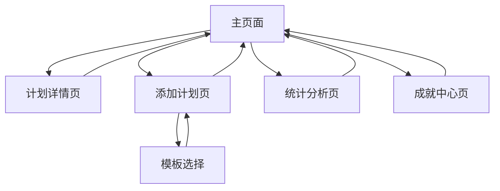

# 每日计划打卡工具（Daily Planner Tracker）产品需求文档

## 1. 产品概述

每日计划打卡工具是一个简洁、高效的计划管理平台，帮助用户管理每日、每周、长期计划，并通过图表统计执行情况。

产品旨在解决用户计划管理分散、进度追踪困难、缺乏数据反馈的问题，为个人用户提供一站式的计划管理解决方案。

目标是打造一个现代化、响应式的Web应用，支持桌面和移动端使用，提升用户的计划执行效率和成就感。

## 2. 核心功能

### 2.1 用户角色

| 角色 | 注册方式 | 核心权限 |
|------|----------|----------|
| 默认用户 | 无需注册，直接使用 | 可创建、管理所有类型计划，查看统计数据，使用所有功能 |

### 2.2 功能模块

我们的每日计划打卡工具包含以下主要页面：

1. **主页面**：计划展示区、快速添加按钮、筛选器、进度概览
2. **计划详情页**：任务详细信息、子任务管理、进度编辑、历史记录
3. **添加计划页**：计划创建表单、模板选择、自然语言解析
4. **统计分析页**：图表展示、数据筛选、导出功能
5. **成就中心页**：徽章展示、激励系统、连续打卡记录

### 2.3 页面详情

| 页面名称 | 模块名称 | 功能描述 |
|----------|----------|----------|
| 主页面 | 计划展示区 | 以卡片形式展示所有计划，显示标题、类型、截止时间、完成进度 |
| 主页面 | 快速添加按钮 | 点击+按钮快速创建新计划，支持快捷输入 |
| 主页面 | 筛选器 | 按状态（未完成/已完成）、时间（今日/本周/本月）、类型筛选计划 |
| 主页面 | 进度概览 | 显示今日/本周整体完成情况的环形进度图 |
| 计划详情页 | 任务信息编辑 | 修改计划标题、描述、时间、重复设置 |
| 计划详情页 | 子任务管理 | 添加、删除、编辑子任务，标记完成状态 |
| 计划详情页 | 进度追踪 | 显示整体进度百分比，子任务完成情况统计 |
| 计划详情页 | 历史记录 | 查看计划的修改历史和完成记录 |
| 添加计划页 | 计划创建表单 | 输入标题、选择类型（每日/每周/长期）、设置时间、添加描述 |
| 添加计划页 | 模板选择 | 提供常用计划模板（晨间例行、项目复盘等）快速创建 |
| 添加计划页 | 自然语言解析 | 解析"周五前完成UI设计"等自然语言输入，自动设置时间和类型 |
| 统计分析页 | 图表展示 | 柱状图显示每日完成数、折线图显示趋势、饼图显示类型占比 |
| 统计分析页 | 数据筛选 | 按周/月/年筛选统计数据，查看不同时间段的完成情况 |
| 统计分析页 | 导出功能 | 将图表导出为图片或PDF格式 |
| 成就中心页 | 徽章系统 | 展示已获得的成就徽章（连续打卡、完成率等） |
| 成就中心页 | 激励提醒 | 显示激励语句和下一个目标提示 |
| 成就中心页 | 统计概览 | 显示总计划数、完成率、连续打卡天数等关键指标 |

## 3. 核心流程

用户首先进入主页面查看当前所有计划，可以通过筛选器快速找到需要的计划。点击快速添加按钮创建新计划，支持选择模板或自然语言输入。点击计划卡片进入详情页查看和编辑具体信息，管理子任务。在统计分析页查看完成情况的图表分析，了解自己的计划执行趋势。通过成就中心查看获得的徽章和激励信息，保持持续使用的动力。

## 4. 用户界面设计

### 4.1 设计风格

- **主色调**：#3B82F6（蓝色）作为主色，#10B981（绿色）作为成功色，#EF4444（红色）作为警告色
- **辅助色**：#F3F4F6（浅灰）作为背景色，#6B7280（中灰）作为文字色
- **按钮样式**：圆角按钮（rounded-lg），支持悬停和点击效果
- **字体**：Inter字体，标题16-24px，正文14-16px，小字12px
- **布局风格**：卡片式布局，顶部导航栏，左侧可选侧边栏
- **图标风格**：使用Heroicons或Lucide图标库，线性风格

### 4.2 页面设计概览

| 页面名称 | 模块名称 | UI元素 |
|----------|----------|--------|
| 主页面 | 计划展示区 | 白色卡片背景，圆角阴影，标题粗体，进度条彩色显示，标签小字体 |
| 主页面 | 快速添加按钮 | 蓝色圆形悬浮按钮，右下角固定位置，+图标白色 |
| 主页面 | 筛选器 | 顶部水平排列的标签按钮，选中状态蓝色背景 |
| 计划详情页 | 任务信息编辑 | 表单样式，输入框灰色边框，聚焦时蓝色边框 |
| 计划详情页 | 子任务管理 | 列表样式，复选框绿色，删除按钮红色，添加按钮蓝色 |
| 添加计划页 | 计划创建表单 | 垂直表单布局，标签在上，输入框在下，提交按钮蓝色 |
| 添加计划页 | 模板选择 | 网格布局的卡片，每个模板一个卡片，悬停时阴影加深 |
| 统计分析页 | 图表展示 | 白色背景的图表容器，彩色图表，图例在底部 |
| 成就中心页 | 徽章系统 | 金色徽章图标，网格布局，未获得的徽章灰色显示 |

### 4.3 响应式设计

产品采用移动优先的响应式设计，在桌面端显示多列布局，移动端自动调整为单列布局。支持触摸交互优化，按钮和可点击区域不小于44px，适配iOS和Android设备。